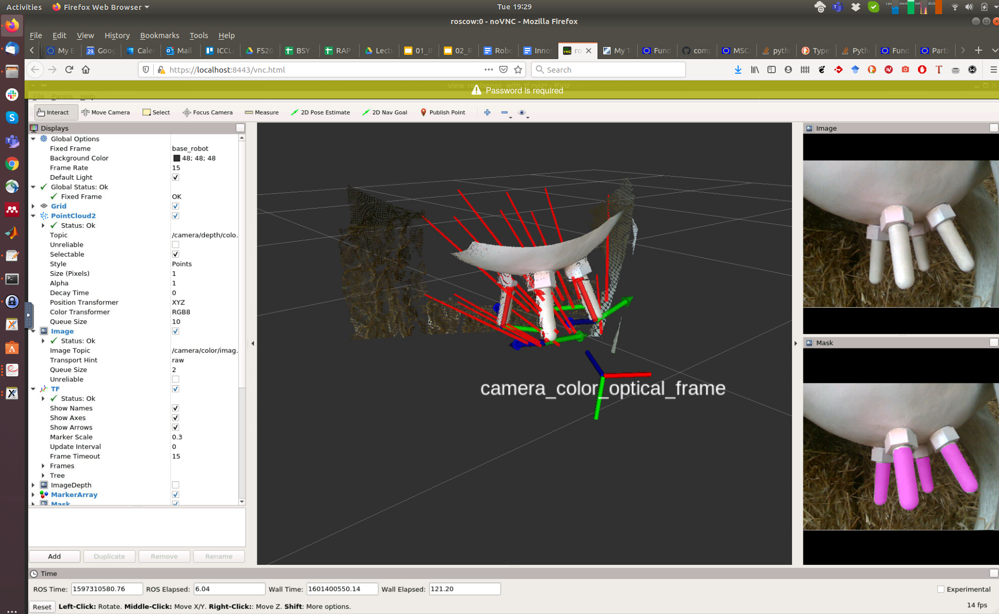
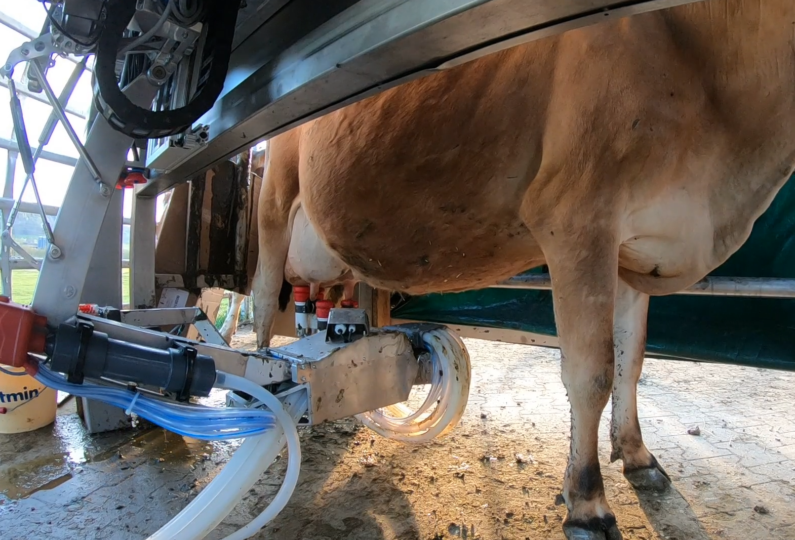
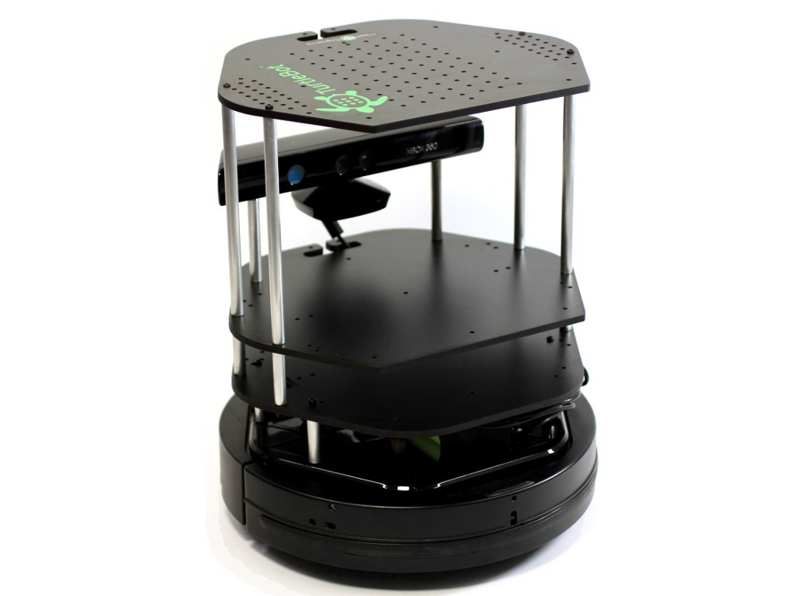

<!-- A showcase of my recent professional work  -->

# Cloud Robotics Initiative @ ICCLab

I currently lead the **Cloud Robotics Initiative** at the [Distributed Systems Group @ InIT]((https://www.zhaw.ch/en/engineering/institutes-centres/init/distributed-systems/)) (a.k.a. ICCLab). 
Our mission is to advance the synergy between cloud computing, robotics, and AI through research, education, and community engagement.

---

# **Overview**

At ICCLab, we focus on:
- **Research**: Pioneering robotics, AI, and cloud integration through Innosuisse and EU Horizon Europe projects.
- **Education**: Teaching robotics, guiding BSc/MSc theses, and hosting impactful workshops.
- **Dissemination**: Sharing knowledge at meetups, conferences, and topic groups.

---

# **Research Highlights**

For a complete list of my publications please refer to my [Google Scholar page](https://scholar.google.com/citations?user=T1oURHYAAAAJ&hl=en)

## ICRA'24

<iframe width="100%" style="aspect-ratio: 4 / 3" src="https://www.youtube.com/embed/6BOOdcVnppY?si=qiZqgQ1zobVxG5UQ" title="YouTube video player" frameborder="0" allow="accelerometer; autoplay; clipboard-write; encrypted-media; gyroscope; picture-in-picture; web-share" referrerpolicy="strict-origin-when-cross-origin" allowfullscreen></iframe>

A Method for Multi-Robot Asynchronous Trajectory Execution in MoveIt2
P Stoop, T Ratnayake, G Toffetti
2024 IEEE International Conference on Robotics and Automation (ICRA)

## IROS'23 - "Task and Motion Planning: from Theory to Practice" Workshop

[https://dyalab.mines.edu/2023/iros-workshop/](https://dyalab.mines.edu/2023/iros-workshop/)

<iframe width="100%" style="aspect-ratio: 4 / 3" src="https://www.youtube.com/embed/5WxXJxRfocs?si=FcY4xrniaZBsDwPE" title="YouTube video player" frameborder="0" allow="accelerometer; autoplay; clipboard-write; encrypted-media; gyroscope; picture-in-picture; web-share" referrerpolicy="strict-origin-when-cross-origin" allowfullscreen></iframe>

A Method for Multi-Robot Asynchronous Trajectory Execution in MoveIt2
P Stoop, T Ratnayake, G Toffetti
IROS 2023 Workshop on Task and Motion Planning: from Theory to Practice

## IROS'22 - "Cloud and Fog Robotics In The Age of Deep Learning" Workshop

[https://sites.google.com/view/iros22-cloud-robotics/](https://sites.google.com/view/iros22-cloud-robotics/)

<iframe width="100%" style="aspect-ratio: 4 / 3" src="https://www.youtube.com/embed/CWYd-MeHG6c?si=ddpijmC111zxtof-" title="YouTube video player" frameborder="0" allow="accelerometer; autoplay; clipboard-write; encrypted-media; gyroscope; picture-in-picture; web-share" referrerpolicy="strict-origin-when-cross-origin" allowfullscreen></iframe>

Cloud Native Robotic Applications with GPU Sharing on Kubernetes
G Toffetti, L Militano, S Murphy, R Maurer, M Straub
IROS 2022 Workshop "Cloud and Fog Robotics In The Age of Deep Learning"

## ICRA'21 -  "Task-Informed Grasping: Agri-Food manipulation" (TIG-III) Workshop

<iframe width="100%" style="aspect-ratio: 4 / 3" src="https://www.youtube.com/embed/o7MBL37yF60?si=09zMdXnRNojJmcRO" title="YouTube video player" frameborder="0" allow="accelerometer; autoplay; clipboard-write; encrypted-media; gyroscope; picture-in-picture; web-share" referrerpolicy="strict-origin-when-cross-origin" allowfullscreen></iframe>

Teat Pose Estimation via RGBD Segmentation for Automated Milking 
N. Borla, F. Kuster, J. Langenegger, J. Ribera, M. Honegger, G. Toffetti
"Task-Informed Grasping: Agri-Food manipulation" (TIG-III) Workshop at ICRA 2021

<!-- 2023 - TomGrowthAI - Using robotics and AI to predict greenhouse tomato yield (Inno Cheque) -->
---
 
# **Projects** / **Robotics Applications**

## **NEPHELE Project (2022-2025) - Ongoing**
A lightweight software stack for managing IoT, edge, and cloud computing with use cases like:
- **Search and Rescue (SAR)**: Coordinating emergency responses with a system-of-systems approach.

<iframe width="100%" style="aspect-ratio: 4 / 3" src="https://www.youtube.com/embed/4XQCg9MkTKA?si=uVE0zG9-qJTwqDen" title="YouTube video player" frameborder="0" allow="accelerometer; autoplay; clipboard-write; encrypted-media; gyroscope; picture-in-picture; web-share" referrerpolicy="strict-origin-when-cross-origin" allowfullscreen></iframe>

## **Green Solar Roof Plant-Cutting Robot (2023-2025) - Ongoing**

Joint work with the [ZHAW Institute of Mechatronic Systems (IMS)](https://www.zhaw.ch/en/engineering/institutes-centres/ims/robotics-automation/)

- **Main Contributions**:
  - 3D SLAM and navigation using custom Nav2 behavior trees
  - Coverage Planning with Fields2Cover
  - AI-based roof life detection
  - Cloud-based Fleet Management and teleoperation

  

## **Milking Robot (2019-2021) - Innosuisse Collaboration with  ZHAW IMS**

Joint work with the [ZHAW Institute of Mechatronic Systems (IMS)](https://www.zhaw.ch/en/engineering/institutes-centres/ims/robotics-automation/)

- Combines AI, computer vision, and robotics.
- **Main Contribution**:
  - Teat pose estimation using RGBD segmentation.
  

 

 

## **ECRP with Rapyuta Robotics (2016-2019)**

<iframe width="100%" style="aspect-ratio: 4 / 3" src="https://www.youtube.com/embed/NCjp2txUSmc?si=QQruviu-DuWaXkfu&amp;start=43" title="YouTube video player" frameborder="0" allow="accelerometer; autoplay; clipboard-write; encrypted-media; gyroscope; picture-in-picture; web-share" referrerpolicy="strict-origin-when-cross-origin" allowfullscreen></iframe>

<iframe width="100%" style="aspect-ratio: 4 / 3" src="https://www.youtube.com/embed/i5-gXNNI8GU?si=gcNOB6ItWnbTEPpE&amp;start=31" title="YouTube video player" frameborder="0" allow="accelerometer; autoplay; clipboard-write; encrypted-media; gyroscope; picture-in-picture; web-share" referrerpolicy="strict-origin-when-cross-origin" allowfullscreen></iframe>

## **FIWARE & FIROS**
- We started working on robotics while working with FIWARE and FIROS to bridge robotics with cloud ecosystems.
- Learn more about [FIROS on ROS.org](https://wiki.ros.org/firos).

---

# **Education**

## **BSc and MSc Theses**

Recent Examples...

### Semantic Mapping with MIT Hydra

<iframe width="100%" style="aspect-ratio: 4 / 3" src="https://www.youtube.com/embed/PzLjYsqXnxg?si=3ElKC44JGZygcTwt" title="YouTube video player" frameborder="0" allow="accelerometer; autoplay; clipboard-write; encrypted-media; gyroscope; picture-in-picture; web-share" referrerpolicy="strict-origin-when-cross-origin" allowfullscreen></iframe>

### Tomato Picking with Mobile Manipulator and Behavior Tree

<iframe width="100%" style="aspect-ratio: 4 / 3" src="https://www.youtube.com/embed/-eZtOmuRg0c?si=VY8RcxMAamKNzFQ3" title="YouTube video player" frameborder="0" allow="accelerometer; autoplay; clipboard-write; encrypted-media; gyroscope; picture-in-picture; web-share" referrerpolicy="strict-origin-when-cross-origin" allowfullscreen></iframe>

### Search and Rescue with Drones

### Navigation in Human-Centric Environments

### Fleet Management
  Coordinating multi-robot systems with Open-RMF.

## **Robotic Applications Programming (RAP-EN)**
A comprehensive robotics course covering:
- **Core Topics**:
  - ROS 1/2 software development.
  - URDF, Xacro, pose in 3D
  - ROS Control
  - SLAM, motion planning, and perception
  - Distributed Robotic Applications
- **Practical Labs**:
  - Challenges in simulation and real-world robots.
- **Hardware we Use**

| Robot | |
| ------ | -------- |
| **SUMMIT-XL Steel** equipped with: Universal Robots UR5 arm; Schunk and Robotiq grippers; Intel Realsense D435 camera and front/back LIDARs. |   |
| ------ | -------- |
| **TurtleBot 2** (2x): LIDAR, Jetson, Astra Depth Camera, and auto-docking. |  |
| ------ | -------- |
| **TurtleBot 3** (6x) |  |
| ------ | -------- |
| **Niryo One** (3x) |  |
| ------ | -------- |

---

# **Community Engagement**

- **ROS Cloud Robotics WG**: core member and mantainer of the [Cloud Robotics Hub](https://cloudroboticshub.github.io/)
- **Meetups**: Organizing ["Robotics and ROS in Zurich" Meetup](https://www.meetup.com/Robotics-and-ROS-in-Zurich/).
- **Workshops**:
  - Organizer of the EURobotics Cloud Robotics WS at European Robotics Forum (ERF).
 

---

# **Contact Us**
For more details, visit our [official website: DSY @ InIT / ZHAW](https://www.zhaw.ch/en/engineering/institutes-centres/init/distributed-systems/).

---

